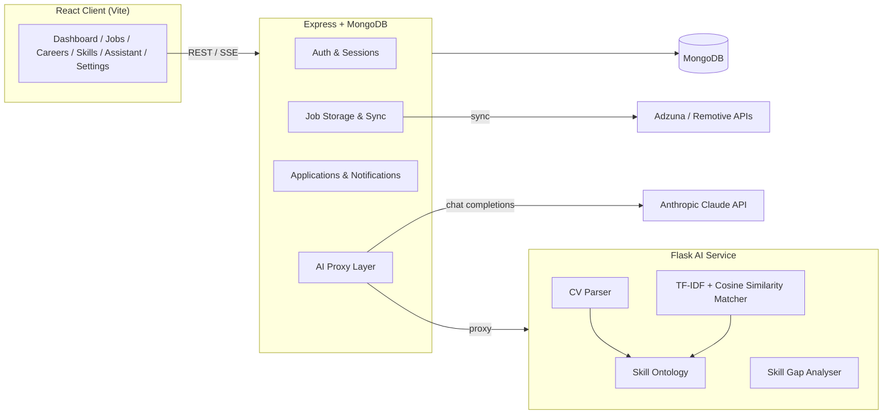

# JobMatch AI

**An AI-powered job matching platform that analyses your CV, scores you against real job listings, and closes the gap with a personalised learning path.**

JobMatch AI combines classical machine learning (TF‑IDF + cosine similarity), a hand-built skill ontology, and a Claude-powered career assistant to help candidates find roles that genuinely fit their background — not just roles that share a few keywords.

---

## Table of contents

- [Overview](#overview)
- [Key features](#key-features)
- [System architecture](#system-architecture)
- [Tech stack](#tech-stack)
- [The matching algorithm](#the-matching-algorithm)
- [Project structure](#project-structure)
- [Getting started](#getting-started)
  - [Prerequisites](#prerequisites)
  - [1. Clone and install](#1-clone-and-install)
  - [2. Configure environment variables](#2-configure-environment-variables)
  - [3. Run all three services](#3-run-all-three-services)
  - [4. Seed data](#4-seed-data)
- [Environment variables reference](#environment-variables-reference)
- [API overview](#api-overview)
- [Deployment](#deployment)
- [Testing the pipeline](#testing-the-pipeline)
- [Troubleshooting](#troubleshooting)
- [Roadmap](#roadmap)
- [License](#license)

---

## Overview

JobMatch AI is a full-stack system made up of three independent services:

| Service                   | Role                                                                        | Port   |
| ------------------------- | --------------------------------------------------------------------------- | ------ |
| **Client** (React + Vite) | User-facing dashboard, jobs, careers, skills, assistant, and settings pages | `5173` |

| **Server** (Express + MongoDB) | Auth, job storage, application flow, notifications, and orchestration between client and AI service | `5000` |

| **AI Service** (Flask + scikit-learn) | CV parsing, skill extraction, TF‑IDF/cosine-similarity job matching, skill gap analysis | `8000` |

A user uploads their CV once. The system extracts their skills, saves them to their profile, scores every open job against those skills using a weighted multi-factor model, and surfaces the best matches, complete with a breakdown of _why_ each job scored the way it did and what to learn to improve the fit.

---

## Key features

- **CV parsing** — Extracts text from PDF, DOCX, and TXT resumes and identifies skills using a curated ontology of 80+ canonical skills and 300+ aliases (e.g. `"ReactJS"`, `"React.js"` → `React`).
- **Explainable job matching** — A five-component weighted composite score (skill overlap, TF‑IDF semantic similarity, role alignment, experience fit, domain alignment) ranks every job, with the full breakdown visible to the user.
- **Real job listings** — Integrates with the Adzuna and Remotive job APIs, cached in MongoDB with a 24‑hour refresh window, instead of static sample data.
- **Skill gap analysis** — Compares a user's skills against any job's requirements and generates a prioritised, categorised learning path with free and paid course recommendations.
- **Career explorer** — Side-by-side role comparison, salary/demand market insights, and multi-step career path visualisations.
- **AI Career Assistant** — A streaming, Claude-powered chat assistant with full context of the user's profile, skills, and CV status — not a scripted bot.
- **Real application flow** — Applying to a job records the application, opens the real listing URL, and sends a confirmation email.
- **Notifications** — In-app notification centre for match alerts, skill gap alerts, and application updates.
- **Settings & profile** — Full account management (profile, password, notification preferences, privacy, data export, account deletion) and a profile dropdown menu.
- **Dark mode**, **toast notifications**, and **fully responsive** design throughout.

---

## System architecture



---

## Tech stack

**Frontend**

- React 18 + Vite
- React Router
- Tailwind CSS (dark-mode aware, `class` strategy)
- Axios
- Lucide icons

**Backend**

- Node.js + Express
- MongoDB + Mongoose
- JWT authentication + bcrypt
- Multer (file uploads) + Nodemailer (application emails)
- Anthropic SDK (streaming chat completions)

**AI Service**

- Python + Flask
- scikit-learn (`TfidfVectorizer`, `cosine_similarity`)
- pdfplumber / PyMuPDF (PDF parsing) + python-docx (DOCX parsing)
- Hand-built skill ontology (alias normalisation)

**External APIs**

- [Adzuna](https://developer.adzuna.com) — broad multi-sector job listings
- [Remotive](https://remotive.com/api) — remote job listings (no key required)
- [Anthropic Claude](https://www.anthropic.com) — the AI Career Assistant

---

## The matching algorithm

Each job's match score is a weighted composite of five components, computed per user:

```
composite = 0.35 × skill_overlap
          + 0.20 × tfidf_similarity
          + 0.20 × role_alignment
          + 0.15 × experience_fit
          + 0.10 × domain_alignment
```

| Component             | Weight | What it measures                                                                                                                      |
| --------------------- | ------ | ------------------------------------------------------------------------------------------------------------------------------------- |
| **Skill overlap**     | 35%    | Recall-weighted intersection between the user's normalised skills and the job's required skills                                       |
| **TF‑IDF similarity** | 20%    | Cosine similarity between the CV document vector and the job description vector — catches semantic matches that keyword search misses |
| **Role alignment**    | 20%    | Token overlap between the user's past job titles and the target job title                                                             |
| **Experience fit**    | 15%    | A piecewise function scoring how the user's years of experience compare to the job's stated requirement                               |
| **Domain alignment**  | 10%    | Overlap between the user's inferred industry domain(s) and the job's domain, out of 13 tracked sectors                                |

The raw composite score (0.0–1.0) is thresholded at **0.22** — anything below is excluded from results — and mapped onto a calibrated 1–99% display scale so no match is ever shown as a false 100%.

This is a **classical ML approach** (TF‑IDF + cosine similarity via scikit-learn), chosen over a neural/transformer model for three reasons: no labelled training data exists for this matching task, resource constraints on free-tier hosting, and — most importantly — full interpretability of every score.

---

## Project structure

```
job-match-ai/
├── client/                  # React + Vite frontend
│   └── src/
│       ├── components/      # layout, jobs, dashboard, skills, careers, assistant, ui
│       ├── context/         # AuthContext, ThemeContext
│       ├── hooks/           # useJobs, useDashboard, useSkillGap, useChat, useNotifications…
│       ├── pages/            # auth, dashboard, jobs, careers, skills, assistant, settings
│       └── data/             # static career/skill reference data
│
├── server/                  # Express + MongoDB backend
│   └── src/
│       ├── config/           # db.js
│       ├── models/           # User, Job, Notification, Feedback
│       ├── middleware/       # auth, errorHandler
│       ├── routes/           # auth, jobs, cv, ai, notifications
│       └── services/         # jobsApiService.js (Adzuna/Remotive sync)
│
└── ai-service/               # Flask AI microservice
    └── app/
        ├── skill_ontology.py # alias → canonical skill mapping
        ├── cv_parser.py       # PDF/DOCX/TXT text + skill extraction
        ├── matcher.py         # TF-IDF + cosine similarity + composite scoring
        ├── skill_gap.py       # gap analysis + learning path generation
        └── routes.py          # Flask API endpoints
```

---

## Getting started

### Prerequisites

- **Node.js** ≥ 18
- **Python** ≥ 3.10
- **MongoDB** (local or [Atlas](https://www.mongodb.com/atlas) free tier)
- API keys for:
  - [Adzuna](https://developer.adzuna.com/signup) (`app_id`, `app_key`)
  - [Anthropic](https://console.anthropic.com) (for the AI Assistant)
  - SMTP credentials (optional — for application confirmation emails)

### 1. Clone and install

```bash
git clone https://github.com/Code-Mole/job-match-ai.git
cd job-match-ai

# Frontend
cd client && npm install && cd ..

# Backend
cd server && npm install && cd ..

# AI service
cd ai-service
python -m venv venv
source venv/bin/activate          # Windows: venv\Scripts\activate
pip install -r requirements.txt
cd ..
```

### 2. Configure environment variables

Create `.env` files in `client/`, `server/`, and `ai-service/` — see the [reference table](#environment-variables-reference) below for the full list.

### 3. Run all three services

Open three terminals:

```bash
# Terminal 1 — Frontend
cd client && npm run dev
# → http://localhost:5173

# Terminal 2 — Backend
cd server && npm run dev
# → http://localhost:5000

# Terminal 3 — AI service
cd ai-service && source venv/bin/activate && python main.py
# → http://localhost:8000
```

### 4. Seed data

```bash
# Seed a starter set of jobs
curl -X POST http://localhost:5000/api/jobs/seed

# Sync real listings from Adzuna + Remotive (requires API keys)
curl -X POST http://localhost:5000/api/jobs/sync

```

Then open **http://localhost:5173**, create an account, and upload a CV to see matches populate live.

---

## Environment variables reference

**`client/.env`**

| Variable       | Description                                                    |
| -------------- | -------------------------------------------------------------- |
| `VITE_API_URL` | Base URL of the Express backend (e.g. `http://localhost:5000`) |

**`server/.env`**

| Variable                                              | Description                                                |
| ----------------------------------------------------- | ---------------------------------------------------------- |
| `PORT`                                                | Express server port (default `5000`)                       |
| `MONGODB_URI`                                         | MongoDB connection string                                  |
| `JWT_SECRET`                                          | Secret used to sign auth tokens                            |
| `JWT_EXPIRES_IN`                                      | Token lifetime (e.g. `7d`)                                 |
| `CLIENT_URL`                                          | Frontend origin for CORS                                   |
| `AI_SERVICE_URL`                                      | Flask service URL (e.g. `http://localhost:8000`)           |
| `ANTHROPIC_API_KEY`                                   | Anthropic API key for the AI Assistant                     |
| `ADZUNA_APP_ID` / `ADZUNA_APP_KEY`                    | Adzuna API credentials                                     |
| `SMTP_HOST` / `SMTP_PORT` / `SMTP_USER` / `SMTP_PASS` | SMTP config for application confirmation emails (optional) |

**`ai-service/.env`**

| Variable           | Description                        |
| ------------------ | ---------------------------------- |
| `FLASK_ENV`        | `development` or `production`      |
| `FLASK_PORT`       | Flask server port (default `8000`) |
| `NODE_SERVICE_URL` | Express backend URL, used for CORS |

---

## API overview

**Auth** — `POST /api/auth/register`, `POST /api/auth/login`, `GET /api/auth/me`, `PUT /api/auth/profile`, `PUT /api/auth/change-password`, `GET /api/auth/stats`, `GET /api/auth/export`, `DELETE /api/auth/account`

**Jobs** — `GET /api/jobs`, `GET /api/jobs/:id`, `GET /api/jobs/match`, `POST /api/jobs/sync`, `POST /api/jobs/:id/save`, `POST /api/jobs/:id/apply`

**CV** — `POST /api/cv/parse` (upload → extract skills → score against jobs, in one call), `GET /api/cv/status`

**AI** — `POST /api/ai/chat` (streaming, Claude-powered), `POST /api/ai/skill-gap`, `POST /api/ai/parse-text`, `POST /api/ai/feedback`

**Notifications** — `GET /api/notifications`, `PUT /api/notifications/:id/read`, `PUT /api/notifications/read-all`, `DELETE /api/notifications/:id`

**AI Service (internal)** — `POST /match`, `POST /parse-cv`, `POST /parse-text`, `POST /skill-gap`, `POST /load-jobs`

---

## Deployment

| Service    | Suggested host                          
| ---------- | ---------------------------- 
| Client     | [Vercel](https://job-match-ai-ui.vercel.app/) 
| Server     | [Render](https://job-match-ai.onrender.com) 
| AI Service | [Render](https://job-match-ai-1.onrender.com) 

Post-deploy checklist:

```bash
curl https://job-match-ai.onrender.com/health
curl https://job-match-ai-1.onrender.com/health
curl -X POST https://job-match-ai.onrender.com/api/jobs/seed
```

---

## Testing the pipeline

```bash
# 1. Confirm the CV route is reachable
curl http://localhost:5000/api/cv/ping -H "Authorization: Bearer $TOKEN"

# 2. Confirm the AI service is alive and its matcher is fitted
curl http://localhost:8000/health

# 3. End-to-end: upload a real CV and see extracted skills + matches
curl -X POST http://localhost:5000/api/cv/parse \
  -H "Authorization: Bearer $TOKEN" \
  -F "file=@/path/to/resume.pdf"
```

---

## Troubleshooting

| Symptom                      | Likely cause                                      | Fix                                                                            |
| ---------------------------- | ------------------------------------------------- | ------------------------------------------------------------------------------ |
| Upload stuck at 10%          | AI service not running, or request has no timeout | Start Flask in its own terminal; confirm `/api/cv/parse` has a bounded timeout |
| `MongoServerError: bad auth` | Wrong Atlas credentials                           | Re-check `MONGODB_URI` username/password                                       |
| CORS errors                  | `CLIENT_URL` mismatch                             | Ensure it matches the Vite dev server URL exactly                              |
| AI Assistant returns 401     | Missing/invalid `ANTHROPIC_API_KEY`               | Set a valid key in `server/.env`                                               |
| No jobs after sync           | Missing Adzuna credentials                        | Set `ADZUNA_APP_ID` / `ADZUNA_APP_KEY`, or rely on Remotive alone              |
| Matcher scores all 0         | Flask fitted before jobs loaded                   | Call `POST /load-jobs` after seeding/syncing, or restart the AI service        |

---

## Roadmap

- [ ] Self-assessed skill proficiency (beyond binary have/missing)
- [ ] Collaborative filtering from real application outcomes
- [ ] Formal IR evaluation (Precision@K, NDCG) against labelled data
- [ ] Multi-language CV parsing
- [ ] Recruiter-facing dashboard

---

## License

This project is provided as-is for educational and portfolio purposes. Add a license of your choice (MIT recommended) before public distribution.
